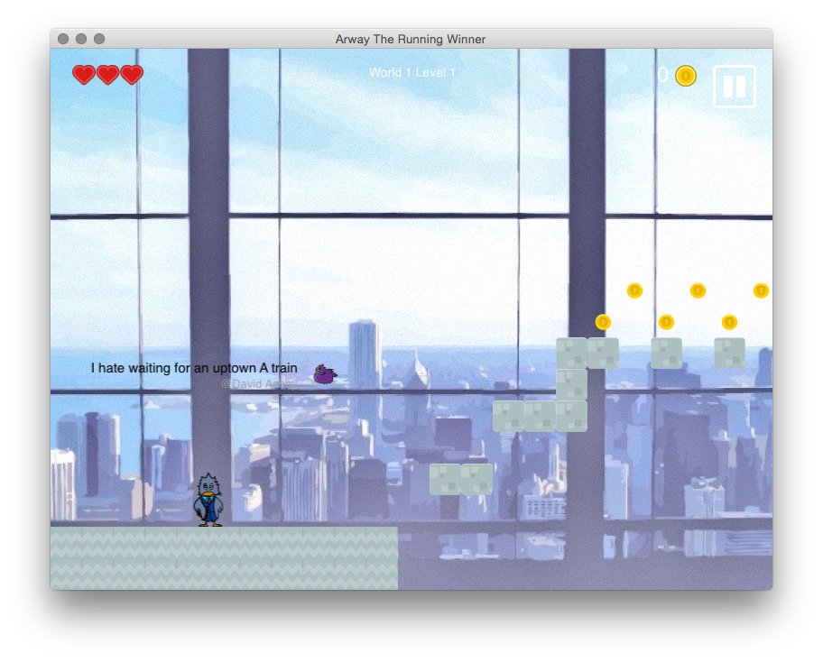
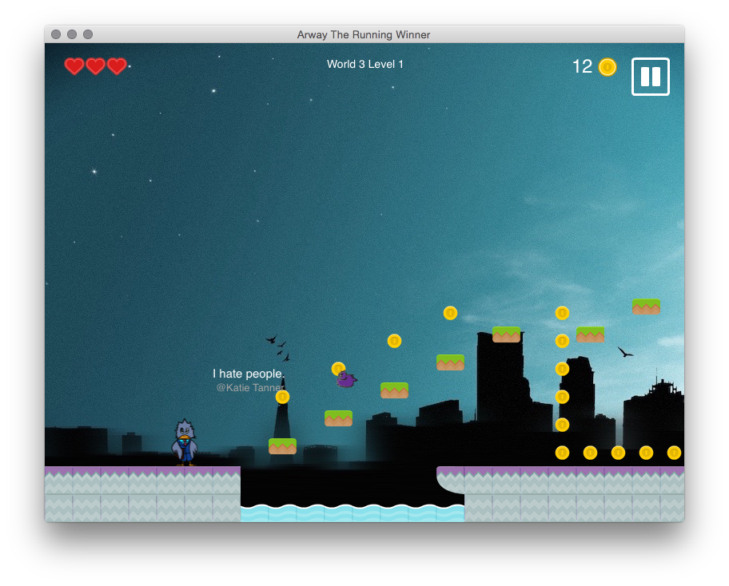
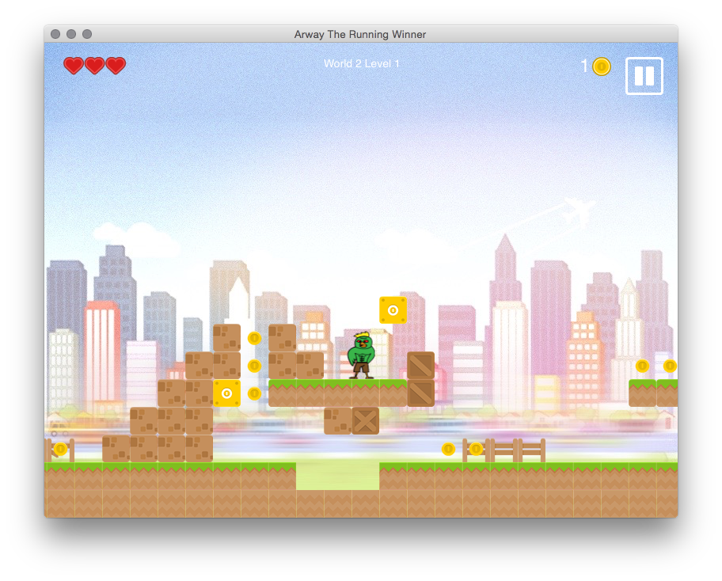
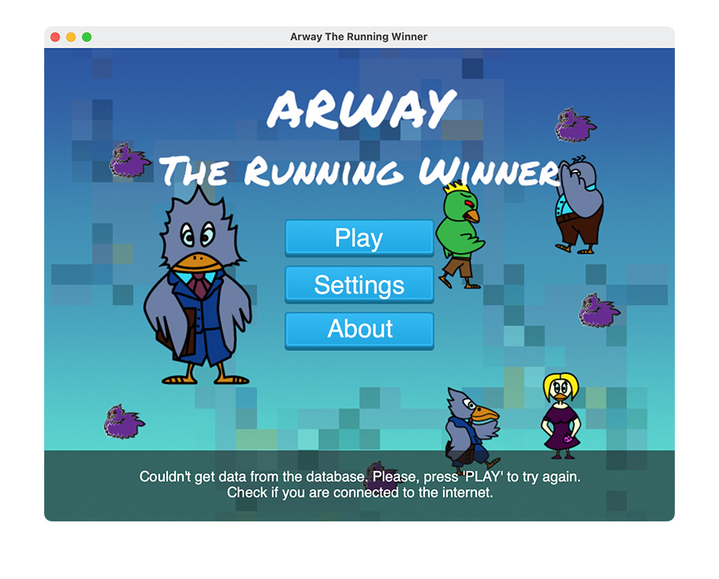
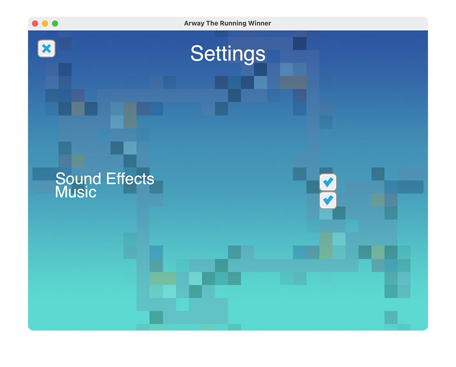
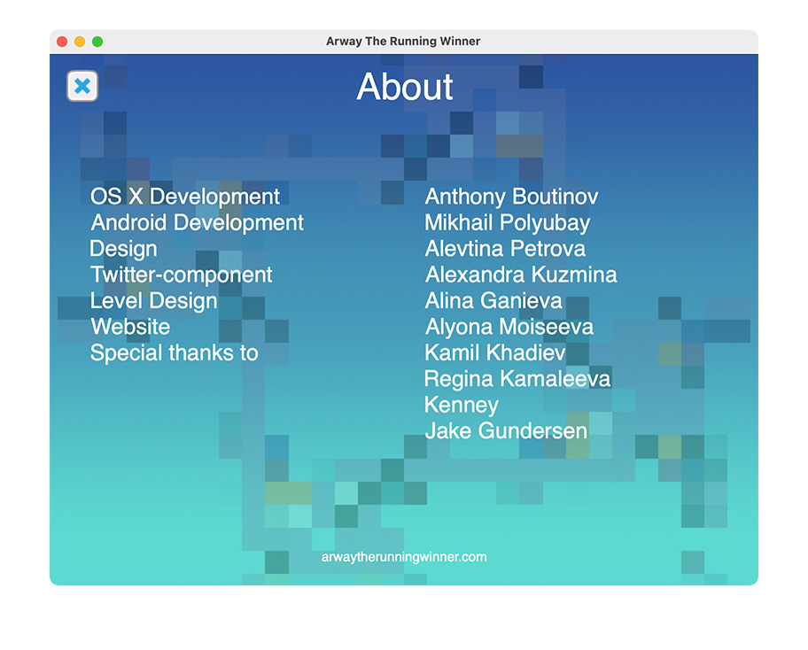

# Awray The Running Winner — OS X Game (SpriteKit), University Study Project

Stack: **Xcode (OS X project)**, **Swift**, **SpriteKit**, **Sparkle**

Requirements: **MacOS ^10.10**; **written in Swift 3 (Xcode 10)**

This is a typical Mario-style platformer, but for enemies it has flying cats that spout hateful tweets. Those tweets are collected from Twitter via Twitter API (that part of code is not included in this repo).

## About

Знакомьтесь, главный герой игры — Arway.

Как любой современный человек, Arway тратит много времени на общение в социальных сетях.
Arway познакомился со своей возлюбленной в Интернете, и живому общению они оба предпочитают виртуальное. Но именно сегодня он решает сделать ей предложение. И как же? Через Интернет. Но в самый важный момент падают сервера. Не в силах выдержать ожидание, он срывается с места и бежит к своей возлюбленной.

Действие игры начинается в офисе, из которого он сбегает. В конце уровня Arway встречает своего начальника, который очень недоволен его побегом. Следующий уровень — улицы мегаполиса, Arway необходимо добраться до дома своей возлюбленной. И вот Arway в доме своей возлюбленной, но ему ещё предстоит её отыскать.

## Credits

- **Антон Бутинов**: Координатор, iOS/OS X разработчик
- **Алёна Моисеева**: Web-разработчик, web дизайнер
- **Михаил Полюбай**: Android разработчик
- **Алевтина Петрова**: Дизайнер
- **Александра Кузьмина**: Twitter-component разработчик
- **Алина Ганиева**: Дизайнер игрового мира

Проект разработан в рамках СК «Программная инженерия и командная разработка», Казанский (Приволжский) Федеральный Университет, Институт Вычислительной Математики и Информационных Технологий
